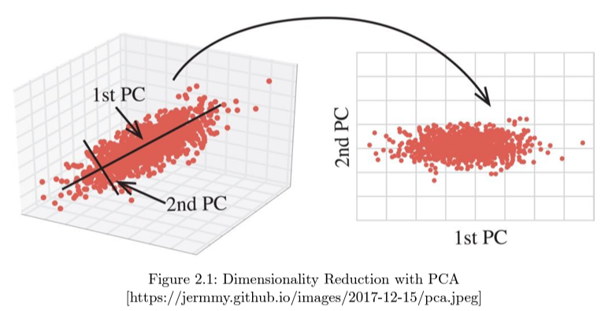
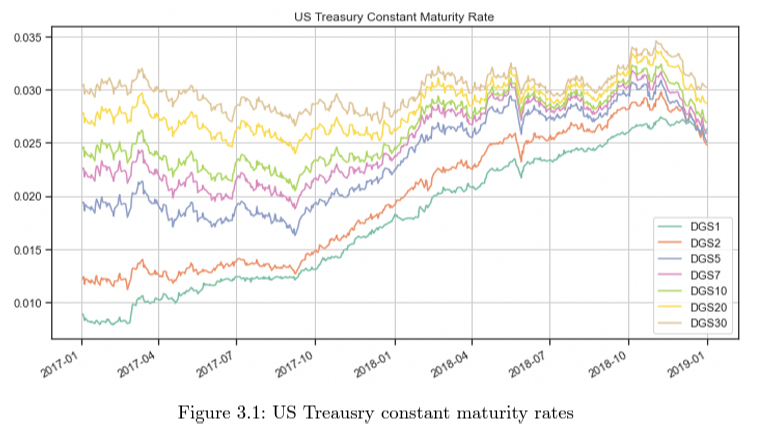
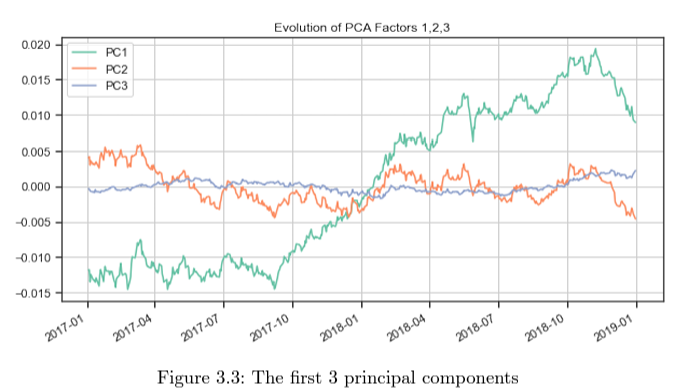
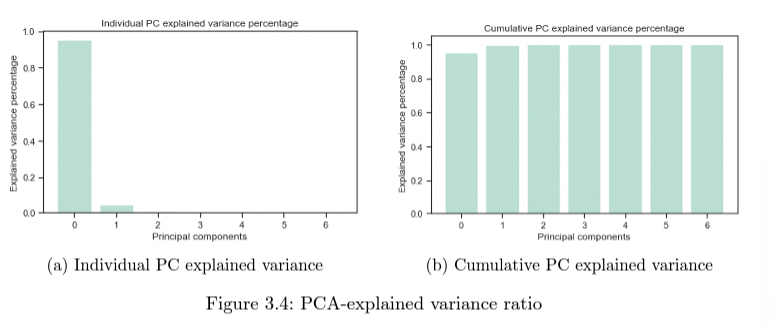
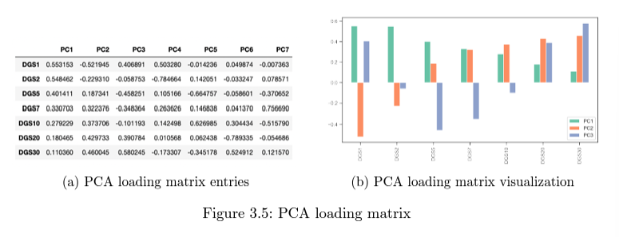
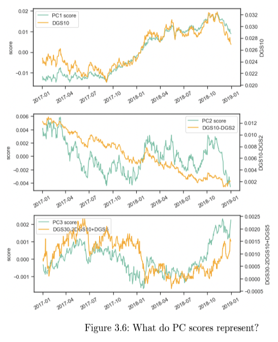
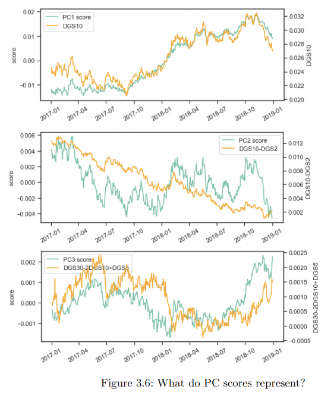
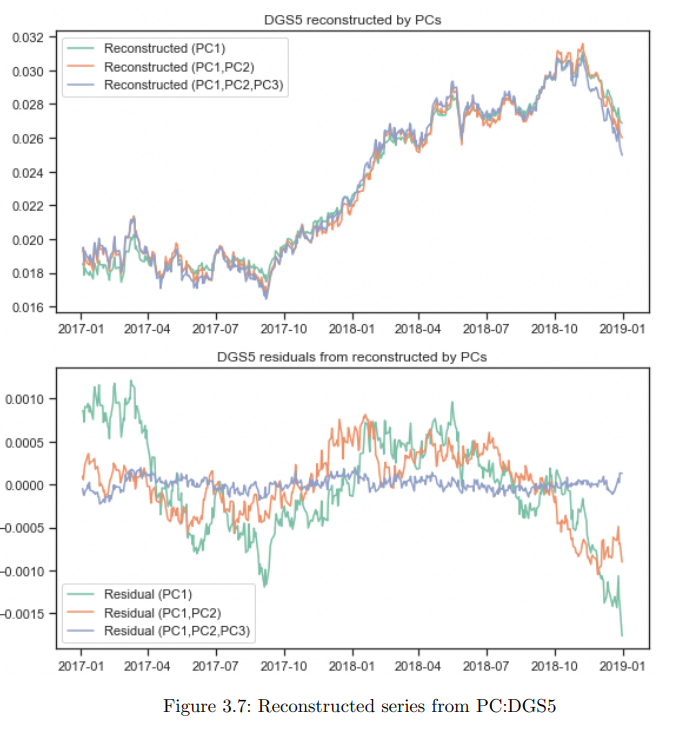
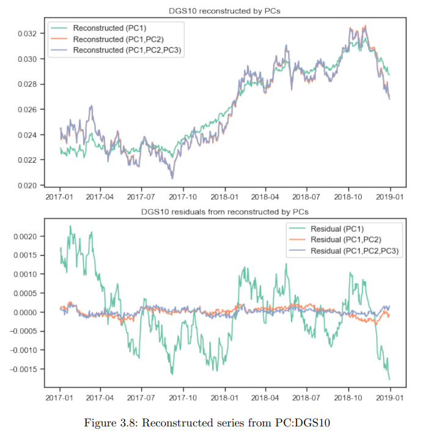
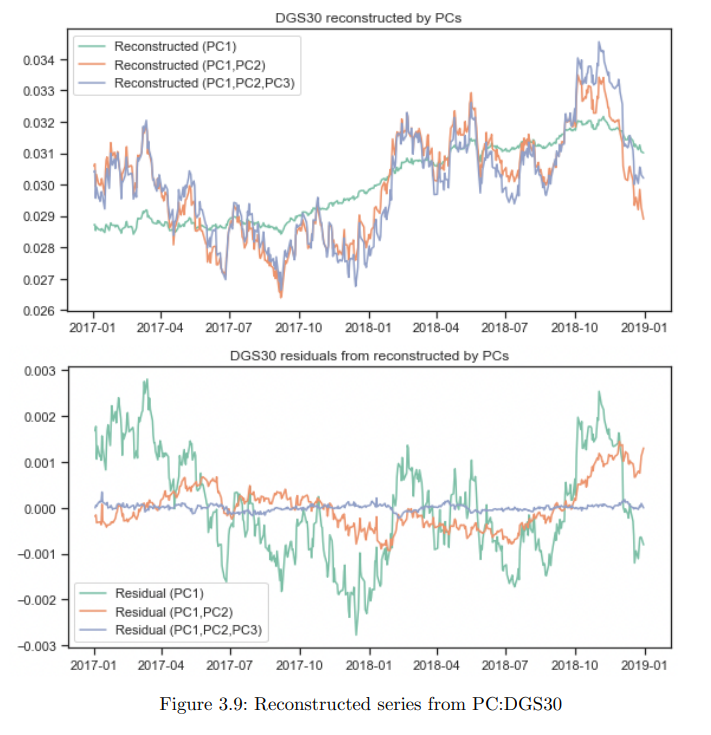

# [PAPER] Term Structure Analysis using PCA

Aleksei Malinovskii 분의 "Term Structure Analysis using PCA"(2022) 논문을 참고하여 본문의 내용을 구성하였습니다.

[reference: Aleksei Malinovskii, "Term Structure Analysis using PCA", 2022](https://fam.tuwien.ac.at/~sgerhold/pub_files/sem21/s_malinovskii.pdf)

# 1 Introduction

- 본 논문은 "Introduction to Machine Learning in Quantitative Finance" 논문을 기반으로 작성
- 해당 논문에서 PCA를 활용한 기간구조 분석 챕터가 있는데, 본 논문에선 Covid-19가 금융위기에 미친 영향을 파악하기 위해 다른 시계열 사용

# 2 Principal Component Analysis

- 차원축소 기법을 통해 머신러닝 알고리즘에서 차원의 저주를 해결할 수 있는데 크게 두 가지 방법이 사용됨
- Feature selection: 도메인 지식이나 통계기법을 사용해서 관련도가 높은 feature를 선별
- Feature projection: 고차원 공간을 저차원 공간으로 선형, 비선형의 방법을 통해 변환
- 가장 기본적인 차원축소 방법 중 하나인 PCA는 데이터를 더 작은 공간에서 데이터의 분산이 극대화하는 방향으로 선형 매핑을 진행
- 실제론 분산을 가장 많이 커버하는, 즉 가장 큰 eigenvalue 값을 갖는 eigenvector를 통해 선형변환
- 기존 공간의 차원은 축소되고 데이터가 유실되지만, 가장 중요한 정보인 분산을 최대한 보존할 수 있음

## 2.2 Principal Component Analysis

- PCA의 목표는 원래 정보를 최대한 보존하는 형태의 축소된 공간을 찾는 것
- 평균이 0인 p차원의 feature 공간 $X=(X_1,...,X_p)$를 가정하고, $Z:=XV$를 만족하는 서로 직교하고 분산을 내림차순하는 선형변환 행렬 $V$를 구하고자 함
- Figure 2.1처럼 orthogonal vectors $Z_k$ (1~p차원)를 찾아서 상위 $l$개 벡터에 기반한 공간으로 축소
  

## 2.3 Linear transformation

- $V=(v_1,...v_p)$를 loading matrix라 할 때, 다음을 만족해야 함

    - 유클리드 norm: $||V_k||^2=1$
    - $V$와 ${Z_k}$가 서로 직교
    - 분산이 내림차순(상위 $n$개를 선택하기 위함)
- 위의 조건을 만족하는 $Z_k$를 k번째 principal component, 또는 kth PC score라 함

- Algorithm 1 PCA: Loading Matrix V
    - test

## 2.4 Singular value decomposition

- Singular Value Decomposition(SVD)은 실수, 복소행렬을 분해하는 작업으로 $X=UDV^T$의 형태로 나타낼 수 있음. 이 때, 아래의 조건을 만족해야 함
    - U는 $N$ x $p$ 차원의 orthonomal matrix, $U$의 행과 열은 orthogonal하고 
- 주성분 Z는 $Z=XV=(UDV^T)V=UD$로 구할 수 있음

## 2.5 Principal components and covariance

- 벡터 X의 covariance matrix는   
$K_{XX}=Cov(X,X)=E[(X−E[X])(X−E[X])]^T=E[XX^T]–E[X]E[X]^T$  
- X가 $\sum_X$를 공분산행렬로 갖는 random vector라 할 때, $AX$ 행렬의 Cov는   
$Cov(AX,AX)=E[(AX)(AX)^T]–E[AX]E[(AX)^T]=E[AXX^TA^T]–E[AX]E[A^TX^T]=AE[XX^T]A^T−AE[X]E^TA^T=AE[XX^T]–E[X]E[X]^TA^T=AΣ_XA^T$ 

(기타 식 생략)

- 요약하면 주성분 $Z_1,...,Z_p$는 직교하고 ($Z^{-1}=Z^T$), 주성분 Z의 분산은 X의 공분산행렬의 고유치를 내림차순 한 값임
- SVD를 통해 공분산을 나타낸 것처럼, PCA를 통해 차원축소 가능

## 2.6 Summary

- 주성분과 loading matrix가 있다면, X를 다음과 같이 나타낼 수 있음
- $X=ZV^{−1}=ZV^T= \sum _{j=1}^p Z_jv_j^T$
- Section 2.5를 통해 상위 k개 주성분은 아래 식으로 나타낼 수 있음
- $X^{(k)}=\sum_{j=1}^kZ_jv_j^T$
- 위의 식을 통해 k=p라면, 원래 데이터를 커버하는 것
- 때문에 상위 몇 개의 주성분을 채택하는지에 따라, 얼마큼 설명력을 갖는지 알 수 있고 이것이 차원 축소하는 효과 가짐
- k개 주성분을 사용했을 때 잔차는 식 (2.15)와 같음

## 2.7 Practical problems

- PCA는 scaling에 따라 일정하지 않음: 때문에 PCA를 사용하기 이전에 정규화를 거쳐야 함
- 데이터가 가우시안이 아니라면 PCA가 적합하지 않을 수 있음: PCA는 정규분포 가정에서 출발했기 때문에, 공분산을 통해 정보를 재현할 수 있음, 정규분포가 아닌 데이터에는 independent component analysis (ICA)를 다룸

# 3 Application: Term Structure Analysis Using PCA

## 3.1 Introduction to fixed income term structure

- 채권은 금융시장에서 만기가 지정된 상품 중 하나로, 국채는 정부가 발행해서 안전한 반면, 회사채는 위험이 있기 때문에 보상이 국채보다 높음

### 3.1.1 Bond yield and yield curve

- 채권수익률은 가격과 이자수익이라는 두 가지 수익 원천이 있는데, 수익률을 바탕으로 yield curve를 도출
- yield curve는 만기까지 시간 흐름에 따라 수익률이 어떻게 나타나는지 그린 것으로, 이를 바탕으로 적정 채권가치를 평가

### 3.1.2 Treasuries bond yield curve and recession

- 국채 수익률 곡선은 벤치마크로 사용되고, 선행지표로 간주되고, 일반적으로 장기국채의 수익률이 더 높음
- 반면 단기증권이 더 높은 수익률을 보이면, 경기침체의 시그널로 받아들임

## 3.2 Factor Model

- X를 p의 만기를 가진 n개의 수익률 곡선이라 하고, 이를 k factor model로 나타내고자 함
- $X=\mu_X+Zf+e$ 와 같은 식을 만들고, i번째 관측치의 j번째 feature는  
$x_{i,j}=\mu_j+\sum_{l=1}^kz_{i,l}f_{l,j}+e{i,j}$로 나타낼 수 있음

- 이 때, 어떻게 팩터를 결정할 수 있을까?
- GDP, 인플레이션 등을 고려한 거시경제 요인이 장기간엔 효과적이지만, 다음과 같은 이유로 장기에는 한계를 가짐
    - 주요 거시경제 요인을 면밀히 관찰할 수 없음
    - 거시경제 요인 간 상관관계가 높을 경우 fitting이 불안정함 
      
- 때문에 외부 요인 보단, slope나 curvature 같이 커브 자체에서 발견되는 요인에 집중하고자 함  

## 3.3 Data and observation

- Figure 3.1을 통해 모든 커브가 같은 방향으로 움직인다는 점에서 공통 요인을 찾아보자는 논리를 정당화   

  

- Figure 3.2를 통해 서로 다른 날짜의 수익률 곡선 기간구조를 볼 수 있는데, Figure 3.1과 다르게 곡선이 다르거나 무관하게 움직이는 것 발견, 이를 세 개의 타입으로 생각해보면
    - Level Change: 모든 만기의 이자율을 평행이동시킴, Figure 3.2의 '2018-02-05'와 '2018-05-17' 비교
    - Slope Change: slope factor의 충격은 단기금리를 장기금리 보다 훨씬 많이 상승시켜, slope가 감소하는 효과, '2018-05-17'와 '2018-12-10' 비교
    - Curvature Change: Curvature의 변화는 중장기 프리미엄과 중단기 프리미엄을 일별로 바꿈  

## 3.4 PCA on term structure

- 수익률 곡선의 움직임이 몇 가지 공통된 요인에 의해 결정된다는 것을 발견했는데, PCA를 통해 이를 알아볼 수 있음
- X를 N일 평균 일일 수익률 변화라 할 때, $X=ZV^T$
  

### 3.4.1 Principal components (Z)
 

 
- Figure 3.3은 상위 세 개의 주성분을 보여주는데, PC1은 변화량이 크지만, PC3는 0을 중심으로 조금 변화

- Figure 3.4에 따르면 95% 정도가, 첫번째 주성분에 의해 설명됨
  
### 3.4.2 Loading matrix (V)

- V는 새 좌표에서 X를 나타내는 loading 행렬로, Figure 3.5처럼 나타남
- 로딩행렬을 통해 가장 큰 영향을 미치는 주성분을 결정할 수 있는데, 절대값이 클 수록 크게 영향

 

  
- PC1은 모든 load가 양수로, PC1 팩터는 수익률 곡선을 같은 방향으로 움직이기 때문에 level change와 관련 있음. 또 대부분의 분산이 PC1에 의해 설명됨
- PC2의 loading은 단기에 음수, 장기로 갈수록 양수로 커지는데, 이를 change in slope라 이해할 수 있음
- PC3의 loading은 0을 중심으로 이동하는데,short, long일 때는 수익률 곡선과 유사하게, belly(중간기간)은 반대로 움직이는 경향. curvature라 이해할 수 있음
  

- 실제 Figure 3.6을 통해 살펴보면, DGS10과 PC1이 거의 일치하고, PC2는 단기채권을 더 크게 반영하기 때문에 장단기차이(10Y-2Y)라 생각할 수 있음.
- PC3는 curvature로 장단기와 중기가 다른 방향(30Y-2x10Y=5Y)으로 움직일 때를 묘사. 세 번째 plot을 보면 유사한 경향을 보임
  

### 3.4.3 Representation of X with PCs

- PCA를 통해 세 개의 주성분으로 원래 데이터를 근사할 수 있음(거의 100%의 설명력) Figure 3.7은 잔차를 보여주는데, 10년 만기의 경우 PC1과 PC2만으로도 움직임에 대한 설명이 충분한 것을 볼 수 있음  

- 30년 만기의 경우, PC1보다 PC2가 포함된 값이 트렌드를 더 잘 설명하고, PC3를 포함하는 것이 좀 더 필수적임
  

  

## 3.5 Term structure analysis during COVID-19 crisis

### 3.5.1 Why this timeline?

### 3.5.2 Data and Results

# 4. PCA for hedging

## 4.1 Hedging

## 4.2 Risk representation

## 4.3 Hedge level and slope with PCA

# 5. Conclusion

