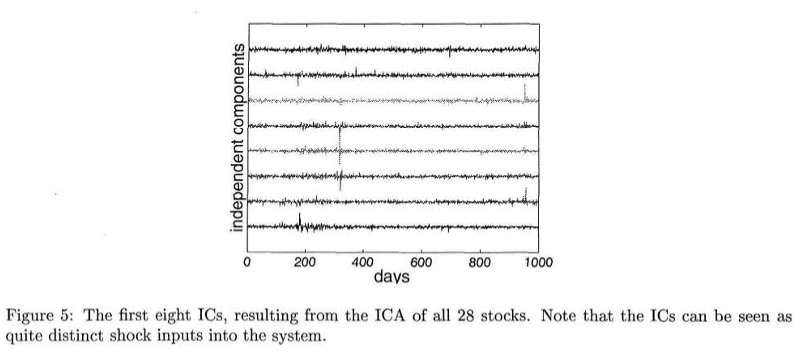

# [PAPER] A First Application of Independent Component Analysis to Extracting Structure from Stock Returns 

Andrew D. Back, Andreas S. Weigend 분의 "A First Application of Independent Component Analysis to Extracting Structure from Stock Returns"(1997) 논문을 참고하여 본문의 내용을 구성하였습니다.

[reference: Andrew D. Back, Andreas S. Weigend, "A First Application of Independent Component Analysis to Extracting Structure from Stock Returns", 1997](https://archive.nyu.edu/bitstream/2451/14180/1/Is-97-22.pdf)

# 0. Abstract

- 주식 수익률을 Independent Component Analysis (ICA) 방법론을 통해 분해하고자 함
- 추정된 IC는 1) 드물지만 큰 충격, 2) 자주 있는 작은 변화 두 가지로 나눌 수 있음
- 전반적인 주가를 가중치 IC를 사용해서 재구성하는데, PC를 사용했을 때보다 더 높은 성능을 보임

# 1. Introduction
- ICA를 사용하기 위해, 관측된 다변량 시계열(일일 수익률)이 독립된 시계열(주식시장 등)로부터 반영된 것이라 가정
- ICA는 또 독립성분을 추출하고자 하는데, 아웃풋의 결합확률과 marginal probability의 KL-divergence를 최소화하여 찾을 수 있음
- IC를 찾는 것은 결합확률을 분해하는 방향, 가장 적은 공통정보를 갖는 방향, 보다 흥미로운 방향을 찾는 것
- ICA와 PCA는 component를 통해 선형변환을 한다는 공통점
- PCA는 상관관계가 없는 주성분을 얻으려 하고 분산이 중요하지만, ICA는 통계적으로 독립적인 component를 얻고자 함
- PCA는 2차통계량까지만 사용하지만, ICA는 더 높은 통계량을 사용할 수 있음
  

# 2. ICA in General
## 2.1 Independent Component Analysis
- ICA는 Input vector $S$로부터 신호 $x$를 가져와서 독립적인 벡터 세트 $y$를 추출하는 과정

- 다변수 시계열 데이터 {$x_i(t)$}가 mixing process $x_i(t)= \sum_{j=i}^na_{ij}s_j(t)$의 결과라 가정
- $y(t)=\textbf{Wx}(t)=\textbf{WAs}(t)$로 바꿀 수 있는데, $A$가 미지의 행렬이기 때문에, W를 찾는데 어려움
- 행렬 W를 찾기 위해 다음과 같이 가정. 
    - Input S가 서로 독립
    - Input이 정규분포 따른다고 가정
    - Input이 정상성을 따른다고 가정 (즉 시간의 흐름에 따른 특징을 보이지 않음)

## 2.2 Algorithms for ICA

- 초기의 ICA 알고리즘은 고차 moment나 고차 누적분(?)(cumulants)를 최소화하고, 아웃풋과 관련된 공통정보를 최대화하고, 결합확률분포와 아웃푹 주변분포의 곱 간의 KL divergence를 최소화하는 방향으로 진행
- ICA 알고리즘의 한 타입인 off-line(batch)는 다음과 같은 절차로 진행
    - Decorrelation or whitening: 인풋의 공분산 행렬을 대각화
    - Rotation: 고차통계량을 최소화하여 아웃풋이 서로 독립임을 보장하고자 함
- 이런 접근법은 인풋이 정규분포가 아님을 가정, 정규분포의 경우 고차통계량은 이미 0이기 때문에 ICA를 통한 분해가 의미 있음(?)

- 본 논문에서는 JADE(Joint Approximate Diagonalization of Eigenmatrices) 알고리즘을 사용했는데, 다음과 같은 순서로 진행됨
    - 샘플 공분산 행렬을 계산해서, 관측된 아웃풋의 이차통계량을 제공(?), 이를 통해 행렬은 관측치를 whiten하는 효과
    - whiten된 데이터에서 4차누적값을 통해 eigen행렬은 대각화하는 rotation matrix를 찾음, 이를 통해 각 component는 독립
      
- JADE와 같은 on-line 업데이트 알고리즘은 매 시점마다 matrix inversion을 해야하는 문제점을 극복함
- 이 외에도 MLE를 기반으로 하는 contextual ICA, nonlinear mixing을 하는 ICA 등 다양한 방법이 시도됨

# 3. ICA in Finance
## 3.1 Reasons to Explore ICA in Finance
- ICA는 주어진 인풋을 Independent Components(IC)로 분해하는 메커니즘
- 본 논문은 ICA를 통해 주가 수익률 변화에 대한 해석가능한 구조를 찾는 것을 목표

## 3.2 Preprocessing
- 다른 시계열 데이터처럼, ICA도 정상성에 대한 가정이 필요. 본 논문에선 주가가 아니라 수익률을 사용해서 정상성을 만족하고자 함

# 4. Analyzing Stock Returns with ICA
## 4.1 Description of the Data
- 도쿄 거래소에 있는 1986~1989년의 시총 상위 28개 회사의 종가를 사용
- 수익률로 normalize하는 과정을 통해 [-1,1]의 범위로 맞춰줌

## 4.2 Structure of the Independent Components
- JADE 알고리즘을 통해 ICA를 구했는데, 첫 번째 IC는 figure5와 같음
  

  

  

- 독립성을 가정한 목표가 1987년의 crash를 몇 가지 component만으로도 잘 포착하기 위함임
- mixing 행렬 A를 수익률에 곱해서 weighted ICs를 구할 수 있는데, 최대 진폭을 가진 IC를 dominant IC라 함, 이 때 분산 같은 다른 측정치는 최대값이 아니라 평균에 주목(?)
- 추정된 IC를 통한 i번째 주식의 return은 $$\hat{x_i}(t-j)=\sum_{k=1}^na_{ik}y_k(t-j)$$와 같이 나타낼 수 있음
- weighted IC를 다음과 같은 식으로 나타낼 수 있음 $$\bar{y}_{ik}(t-j)=a_{ik}y_k(t-j)$$
- 본 논문에선 weighted IC를 first stock return의 관점에서 rank했기 때문에, IC를 mixing matrix에 곱해서 weighted IC를 얻음
  

  

- 주식 수익률을 통해 얻어진 IC는 다음과 같은 특징 가짐
    - 소수의 IC가 주식 수익률 움직임을 대부분 설명
    - 지배적인 IC의 최대 진폭이 주요 level 변화를 설명함
    - 작은 진폭의 IC가 작은 시점 변화에 영향을 줌(?)
- Figure7을 통해 주요 몇 개의 IC가 대부분의 움직임 설명하는 것을 알 수 있음

  

## 4.3 Thresholded ICs Characterize Turning Points

- 앞선 섹션에선 첫번째 IC만을 활용한 누적합을 통해 손실이 큰 방향에 대해 살펴봤는데(?), 이번 섹션에선 이 지배적인 IC의 threshold에 대해 살펴보고자 함
- threshold reconstruction은 낮은 레벨의 component를 제거하여 다음과 같은 식으로 나타낼 수 있음

$$ \bar{x}_i(t-j)= \sum_{k=1}^{n}g(\bar{y}_{ik}(t-j)) \\ g(u)=\begin{Bmatrix}
u  \\ 
 0
\end{Bmatrix} $$

- ICA를 통해 재결합한 주가는 다음과 같은 식으로 나타낼 수 있음
$$ \hat{p}_i(j+1)=\hat{p}_i(j)+\hat{x}_i(j) \\ \hat{p}_i(t-N)=p_i(t-N) $$ 
  
  
- Figure 8,9를 통해 알 수 있듯이, IC에 threshold를 두어 중요한 정보를 추출할 수 있음

## 4.4 Comparison with PCA

- PCA는 팩터 모델에서 많이 사용하는 잘 정립된 방법론인데, 본 챕터에선 ICA와 비교하고자 함
- 주식수익률을 통해 얻어진 PC(principal component)는 다음과 같은 특징을 가짐
    - ICA에서 발견된 큰 쇼크가 발견되지 않음
    - 초기 네 개의 PC로 수익률 곡선을 재구성했는데, IC들을 통해 재구성한 것보다 피팅이 안됨
    - IC처럼 threshold를 거치자 모양이 크게 달라짐
- IC를 사용했을 때와 네 개의 상위 PC는 같지만, 그 순서는 달라짐
- 결론적으로, PCA도 원래 데이터를 분해하지만, ICA를 통해 얻은 고차 누적치를 포함하지 않음, 특히 큰 쇼크가 있었던 부분을 잘 포착하지 못함
  

# 5 Conclusions 

- 본 논문은 포트폴리오에 ICA를 적용시켜 독립적인 구성요소를 찾고자 했는데, 이를 통해 1) 드물지만 큰 충격 2) 자주 있지만 작은 변동의 크게 두 가지 방향으로 IC를 분해함
- ICA를 통해 주식시장 데이터 구조를 바라보는 새로운 시각 제공
