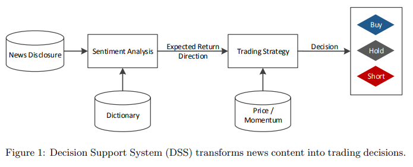

# [PAPER] News-based trading strategies

Stefan Feuerriegel et al 분의 "News-based trading strategies"(2018) 논문을 참고하여 본문의 내용을 구성하였습니다.

[reference: Stefan Feuerriegel et al, "News-based trading strategies", 2018](https://arxiv.org/pdf/1807.06824.pdf)

# 0. Abstract

  
# 1. Introdiction

- 시장이 효율적인지는 정보 이용가능성에 의해 좌우되는데, 뉴스 정보는 실제 주식 시장에 크게 영향을 미치기 때문에 시장 효율성에 중요함
- 선행 연구를 통해 뉴스와 주식시장 사이를 연결했지만, 구체적으로 어떻게 투자 의사 결정을 용이하게 하는지는 미지수
- 본 논문은 뉴스 감성이 **<u>실제 뉴스기반 트레이딩에 어떻게 활용될 수 있는지</u>** 말하고자 함  

- 본 논문은 아래와 같은 방법으로 트레이딩을 위한 Decision Support System에 대해 살펴보고, 결과의 정확성을 평가하고자 함
    - 다양한 규칙기반 거래전략을 제시
    - 뉴스 기반 거래 시스템이 뉴스 기반 데이터에 유의미한 투자 결정을 낸다는 증거 발견

  
# 2. Related work
- 뉴스 기반 거래 시스템의 구성에 대해 간단하게 설명하고자 함
## 2.1 Benchmarks
- 거래 전략의 성과를 검증하기 위해선, 주가 지수와 같은 벤치마크를 삼아야 함
## 2.2 Transaction fees
- 거래 비용이 고려되야 하지만, 많은 선행연구는 이를 무시하고 있음
## 2.3. Trading strategies
- 최근 논문들은 딥러닝(오토인코더) 학습을 통해 결과를 예측하는데, 재무 공시의 예측력을 고려되지 않음
- 본 논문에선 다양한 데이터 마이닝 알고리즘을 사용해서 **<u>규칙 기반 뉴스 거래 알고리즘</u>** 을 제안하고자 함

# 3. Background
- 데이터셋과 감성 분석에 대한 배경을 소개하는 챕터

## 3.1 Data sources
- 기업들이 하는 **<u>수시(ad-hoc)공시(정보 불균형을 해소하기 위해 기업의 주요 경영정보 변경을 지체없이 공시하도록 하는 것)</u>** 는 가격에 단기적인 영향을 미치는 내용이 담겨있고, 사전 승인이 필요하기 때문에 퀄리티를 보장할 수 있음
- 이에 본 논문은 수시공시를 기반으로 한 뉴스 데이터를 활용하고자 함

## 3.2 Sentiment analysis

- 감성분석: 문서의 텍스트 재현(representation: 텍스트를 수치형 자료로 변환하는 것)을 통해 긍정 부정을 측정하는 방법론 
- 본 논문에선 **<u>뉴스 발표 후 주가 움직임을 통해 텍스트 데이터의 영향을 측정하고자 함</u>**

# 4. Trading strategies

- Figure1은 뉴스 거래 기반 의사결정 시스템을 그림으로 표현한 것. 크게 다음 과정을 포함하고 있음
    - 텍스트를 통해 뉴스 감성을 추출함
    - 거래 전략에 기반해 거래를 실행
- 본 논문에선 아래 두 가지 전략을 결합해서 거래 전략 제안
    - **<u>자산의 과거수익률 기반으로 변화율을 극대화하는 모멘텀 매매 기법</u>**
    - 뉴스 심리 신호를 통해 투자의사결정 제안
    - 위의 두 가지를 혼합해 거래를 자동화하기 위해 지도학습과 강화학습 활용
- 다만 뉴스에 지나치게 민감하게 반응하는 동전주는 평가에서 제외

## 4.1. Benchmarks: momentum trading and portfolio approach

$$ RoC_{i,t}=\frac{p_{i,t}-p_{i,t-\delta}}{p_{i,t-\delta}} $$
- $p_{i,t}$는 t 시점의 i 주식의 가격

- 변화율(Rate-of-change, 이하 RoC)을 하나의 벤치마크로 삼아 변화율이 높은 주식으로 매수, 매도하는 전략 사용
- 이 때 **<u>20개의 주식 포트폴리오 간의 비교를 통해 상대적 변화율로 매수 매도 결정을 하므로, 수익률과 위험이 평균화되는 효과 가짐</u>**

## 4.2. Rule-based news trading
- 뉴스에 기반한 거래를 위해, 새로운 공시가 나오면 감성을 새롭게 산출
- **<u>특정 보도의 뉴스심리가 지나치게 긍정적이거나 부정적이면 그에 맞게 주가가 움직일 확률 높음</u>**
- 주식 A에 대한 시그널이 positive 임계값인 $\theta_S^+$ 보다 크거나, negative 임계값인 $\theta_S^-$ 보다 작으면 거래

## 4.3. Combined strategy with news and momentum trading
- 앞의 두 챕터에서 다룬 모멘텀과 뉴스심리 방법을 결합해서, **<u> 1) 극단값으로 가는 뉴스 공시를 갖고, 2) 이전 모멘텀과 동일한 방향으로 가는 자산에 투자하고자 함</u>**

## 4.4. Strategy learning
- 
