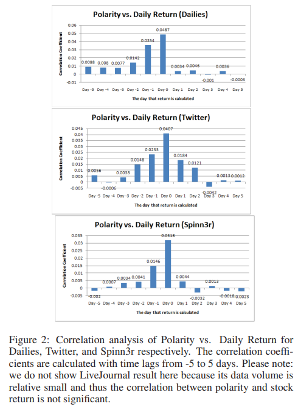
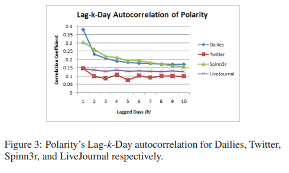
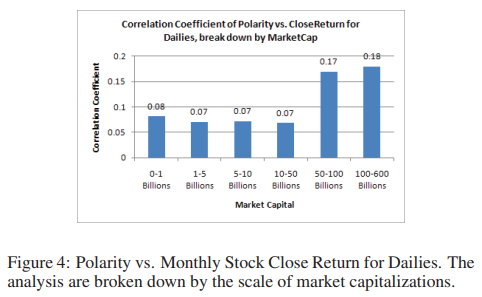
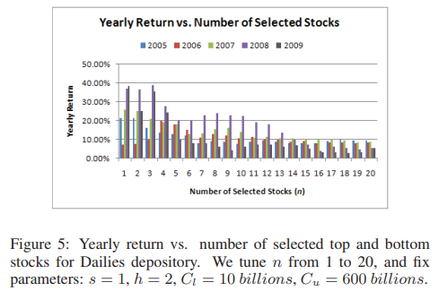

# [PAPER] Trading Stragegies To Exploit Blog and News Sentiment

Wenbin Zhang et al 분의 "Trading Stragegies To Exploit Blog and News Sentiment"(2010) 논문을 참고하여 본문의 내용을 구성하였습니다.

[reference: Wenbin Zhang et al, "Trading Stragegies To Exploit Blog and News Sentiment", 2010](https://www3.cs.stonybrook.edu/~skiena/lydia/blogtrading.pdf)

# 0. Abstract

# 1. Introduction
- 시장이 효율적이라면, 시장 투자자들은 알려지지 않은 정보에 기반해서 초과수익을 내야 함.
- 하지만 선행 연구를 통해 **<u>금융지표의 움직임이 기업 펀더멘탈과 항상 일치하지 않음을 알았기 때문에, 주가의 변동성을 설명하기 위한 다른 증거를 찾을 필요가 있음.</u>**
- 본 논문은 아래의 방법으로 **<u>블로그와 뉴스 속 주식 데이터를 통해 투자 전략을 설계하는 방법에 대해 말함</u>**
    - 블로그와 뉴스 속 데이터 비교
    - 수천 개 기업에 대한 블로그 및 뉴스 데이터 분석
    - 코퍼스의 크기가 중요함
    - 감성 기반의 주식 거래
    - 감성 분석의 검증

# 2. Related Work
- 금융 분야의 선행 연구를 통해 다음 사실을 밝힘
    - 주가는 부정적 뉴스 기사에 하루 지연되서 반영됨 ([Tetlock 2007](https://onlinelibrary.wiley.com/doi/abs/10.1111/j.1540-6261.2008.01362.x))
    - 투자자들은 나쁜 뉴스에 늦게 반응하고, 뉴스가 없는 극단적 움직임은 다음달에 역전됨 ([Chan 2003](https://www.sciencedirect.com/science/article/abs/pii/S0304405X03001466))
    - 인터넷 주식 게시판을 통해 bullishness한 내용이 수익률에 유의미한 영향을 주었고, 논란이 많으면 거래량이 높음 ([Antweiler and Frank 2004](https://onlinelibrary.wiley.com/doi/10.1111/j.1540-6261.2004.00662.x))
- 컴퓨터 과학 분야의 선행 연구를 통해 다음 사실을 밝힘
    - 문서나 단어의 범주를 긍정, 부정, 중립 3-category로 분류
    - 감성분석 정확도를 개선하기 위한 기술적 연구

# 3. Stock and Media Data
- 본 논문에서 사용한 데이터는 아래와 같음

## 3.1 Stock Data
- 2005년~2009년까지 3238개 종목의 일별 시가, 종가, 고가, 저가, 매출액, 월별 시가총액 데이터(Thomson Datastream Services(Datastream))

## 3.2 Media Data
- 기업 관련 블로그 및 뉴스 데이터는 Lydia(Lloyd, Kechagias, Skiena 2005)를 통해 생성
- 사용한 데이터는 아래와 같음
    - 500개 이상의 일간지
    - 트위터
    - 블로그 모음인 Spinn3r RSS Feeds
    - LiveJournal에서 제공하는 모든 블로그

## 3.3 Media Timing Issues
- 결과를 해석할 때 텍스트 검색 에이전트의 타이밍 이슈에 대한 고민이 필요함
- 전날 뉴스의 수집 시간이 오래 걸리기 때문에, 다음날 개장전까지 모든 뉴스가 수집되었다고 보장할 수 없음

## 3.4 Lydia Sentiment Analysis
- Lydia sentiment data는 긍정 부정 단어로 구성되어 있는데, 금융시장은 General Sentiment가 가장 관련성 높음
- N: 총 뉴스 수, p: 양의 뉴스 수, n: 음의 뉴스 수라 할 때, 지표는 아래와 같음
    - polarity = (p − n)/(p + n)
    - subjectivity = (n + p)/N
    - pos_refs_per_ref = p/N
    - neg_refs_per_ref = n/N
    - senti_diffs_per_ref = (p − n)/N
- 해당 지표들은 원시 데이터와 상관성이 낮기 때문에 다중공선성을 피할 수 있음

## 3.5 Matching Stock / Media Entities
- 뉴욕 증시에 상장된 First Commonwealth Financial이 "First Commonwealth Financial", "First Commonwealth Financial Corporation", "First Commonwealth Financial Corp" 세 개의 엔티티를 갖기 때문에, 많은 주식과 엔티티를 통일시켜줌

## 3.6 Intercorrelationship Among Media Sources
- 네 개의 말뭉치 데이터 중 두 개씩 묶어 기준빈도, 정서극성, 주관성 상관관계를 측정한 결과 꽤나 높은 상관성을 보임
- 즉 여러 코퍼스 간에 유사한 결과가 나옴

# 4. Correlation of Media / Stock Data
- 본 챕터에선 미디어 데이터와 주식 데이터 간의 상관관계를 측정함

## 4.1 Media Frequency vs. Trading Volume
- **<u>미디어 보도 수가 많으면 거래량 증가로 이어지나?</u>** (기사 수를 정규화시켜서 측정)
- 아래의 결과를 얻음
    - 상관관계: 네 개의 말뭉치 데이터 모두 주식 거래량과 0.4이상 기록
    - 일간: 0.2715, 월간: 0.4204, 연간: 0.4747 기록
    - 오늘 기사 수와 내일 거래량의 상관관계는 0.74
    - 제약, 바이오, 항공우주 등은 0.7 이상의 상관관계, 전기전자, IT는 0.2 미만
    - 시가총액이 큰 기업일수록, 상관계수가 더 높음

## 4.2 Frequency vs. Capitalization
- **<u>미디어 보도 수와 시가총액 크기가 관련있나?</u>**
- 0.42의 상관관계를 기록해서 통계적으로 유의함

## 4.3 Media Polarity vs. Stock Returns
- **<u>기업에 대한 여론의 극성(긍정, 부정)이 수익률에 영향 미치는가?</u>**

### 4.3.1 Variable Selections
- 위 문제를 풀기 위해 서 가지 다른 척도, 주가 변화, 주식 수익률, 비정상 수익률(R"(s))을 고려
$$R'(s) = R(s) − R(NYSE)$$
- [극성, 극성의 변화, 극성의 백분율 변화] 변수를 [주가 변화, 주가 수익률, 주식 비정상 수익률]과 상관관계 분석
- **<u>(극성, 주식 수익률)이 가장 유의한 상관관계 보여줌</u>**

### 4.3.2 Correlation Analysis with Shifting of Time

- **<u>대부분의 매체에서 당일이 지나면 상관관계가 급감하여, 예측력이 소멸됨을 보여줌</u>**

### 4.3.3 Blogs vs. News
- 

### 4.3.4 Strengthening the Correlation

## 4.4 Subjectivity vs. Trading Volume

# 5. A Sentiment-Based Trading Agent

## 5.1 The Market-neutral Strategy

Require: $n, s, h, [Cl, Cu], M, [Ds, De]$.
Get a list of matched pairs of NYSE stocks and firm entities in blogs/news.
For each matched pairs, get the stock price and firm polarity time series.
for each day Di from Ds to De do
    if Di is one of the first h trading days in [Ds, De] then
        Sort all stocks based on their polarity of day Di, with filtering out stocks
        if their corresponding market capitalization is not in [Cl, Cu].
        For each stock in top/bottom list, invest M/(2nh) with open prices.
7: else if Di is one of the final h trading days in [Ds, De] then
8: Sell stocks bought at trading day (Di − h) with open prices.
9: else
10: Sort all stocks based on their polarity of day Di, with filtering out stocks
if their corresponding market capitalization is not in [Cl, Cu].
11: Sell stocks bought at trading day (Di − h) with open prices, get bank
roll MDi
.
12: For each stock in top/bottom list, invest MDi
/(2n) with open prices.
13: end if
14: end for
15: return Final bank roll M′
, and yearly/monthly return R.

## 5.2 Performance Evaluation

## 5.3 Returns and Volatility

## 5.4 Long vs. Short

# 6. Conclusions
