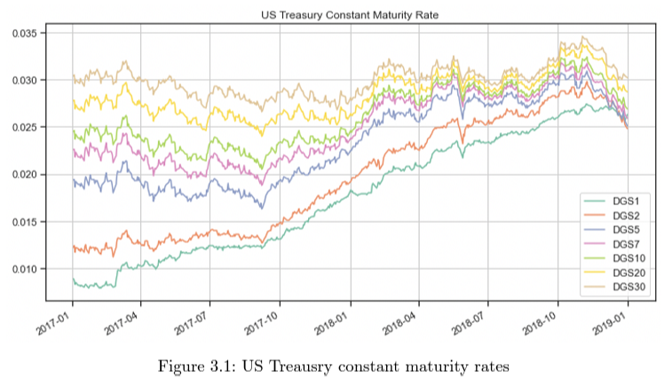
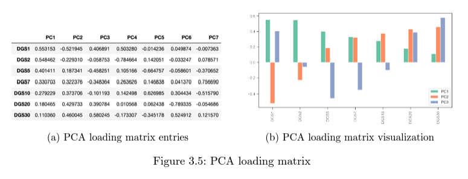
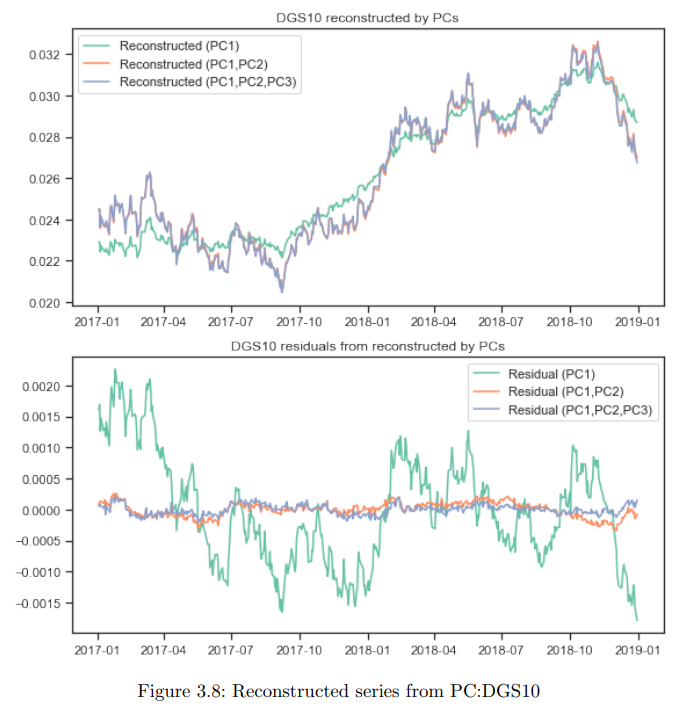

# [PAPER] Do Prompt-Based Models Really Understand the Meaning of Their Prompts

[reference: Albert Webson et al, "Do Prompt-Based Models Really Understand the Meaning of Their Prompts", 2021](https://arxiv.org/pdf/2109.01247.pdf)

# Abstract
- 최근 다양한 프롬프트 기반 모델을 이용한 제로샷 및 퓨샷 학습 발전
- 인간과 유사하게 프롬프트를 통해 모델들이 더 빨리 학습할 수 있다고 믿어짐
- 본 연구는 Natural Language Inference(NLI)를 위해 30개 이상의 수동으로 작성된 프롬프트 템플릿으로 실험
- 연구 결과, 모델은 잘 구성된 지시 프롬프트와 마찬가지로 관련이 없거나 오해의 소지가 있는 프롬프트 또한 빠르게 학습
- 이는 1750억 개의 파라미터를 가진 대형 모델과 수백 개의 프롬프트에 대해 훈련된 최근 개발된 instruction-tuned 모델에서도 보여짐.
- Instruction-tuned 모델은 오히려 zero-shot일 때 관련성이 없고 오해의 소지가 있는 프롬프트로 정확한 예측을 수행
- 즉, 프롬프트 기반 모델의 인상적인 발전에도 불구하고 상당한 한계를 발견
- 과연 인간 이해와 유사한 방식으로 instruction을 이해해서 성능 개선이 있는지 의문제기

# 1 Introduction

- 본 논문은 시행착오 학습과 명확한 명령어를 사용한 학습의 차이를 아래 예시를 통해 보여줌
- Pretrained and fine tune setup
    - No weapons of mass destruction found in Iraq yet.
    - Weapons of mass destruction found in Iraq.
    - 두 문장의 정답 레이블을 찍을 때마다, 정답이 주어지며 이를 통해 학습
- Prompt setup
    - Given that "no weapons of mass destruction found in Iraq yet.", is it definitely correct that "weapons of mass destruction found in Iraq."?
    - 모델이 훨씬 더 정확하게 문제를 풀 수 있음

- 인간이 명령어를 이해하는 방식과 유사하게, 프롬프트를 통해 기존의 fine-tuning보다 성능이 크게 향상된다고 가정
- 특히 최근 연구에 따르면, 전문가가 작성한 프롬프트가 자동 프롬프트 보다 성능이 좋고, 이를 통해 위의 가설이 강화됨
- 본 논문은 zero-shot, few-shot 모두에서 자연어 추론 언어 모델을 평가하여 가설을 테스트 
    - 수동으로 작성된 30개 이상의 템플릿과 13개의 LM 대상 단어 세트를 사용하며 총 390개 이상의 프롬프트
- 관련성이 없거나 오해의 소지가 있는 템플릿을 사용한 모델이 좋은 템플릿과 유사한 속도로 학습
- 프롬프트 기반 모델에 의한 제로샷 및 퓨샷 학습이 성능향상이 설사 일어나도, 인간과 유사하게 이해하기 떄문은 아님...

# 2 Related Work

### **Discrete Prompts** 
- 일회성 명령(이전 프롬프트와 관련 없음, 오늘 서울 날씨는?)
- 템플릿 텍스트로 예제를 재구성하고 수동으로 작성하거나 자동으로 생성
- {sent} In summary, the restaurant is [prediction], class prediction: {sent} In summary, the restaurant
is [prediction]
### **Priming(In-Context Learning)** 
- priming: 모델에 특정 데이터나 정보 미리 제공해서 후속 출력에 영향주는 과정
- 평가 예제에 Priming 예제를 추가하여 템플릿으로 포장
-  Question: {sent1} True
or false? {label1} ... Question:
{sentk} True or false? {labelk}
Question: {eval_sent} True or
false? [prediction].
- 예제를 기반으로 모델 파라미터를 업데이트하지 않으며 주로 가장 큰 GPT-3 모델에서 잘 수행
### **Continuous Prompts** 
- 이전 입력이 다음 번 출력에 영향, "오늘 서울날씨는? + 내일은?"
- 학습 중에 임의로 업데이트되는 특수 토큰으로 예제를 준비
- 퓨샷에서는 효과 x

## ** 2.2 Analyses of Prompts ** 
- 본 논문은 문구와 시맨틱스을 수동으로 제어할 수 있기 때문에 이산 프롬프트 사용
- 프롬프트 시맨틱스의 효과는 모델의 k-shot(몇 개 알려주는 것이 가장 좋은가), k = {0, 4, 8, 16, 32, 64, 128, 256} 성능으로 측정
- 결국, 모델이 정교한 프롬프트 지시로 성능개선이 된다는 선행 연구들 있었음

# 3 Overall Setup

## **모델 구현** 
- Schick and Schüze(2021b)와 유사한 수동 discrete 프롬프트 구현
- 프롬프트 자체의 효과를 평가하는 데 초점

## **Baseline 모델** 
- BERT, DistilBERT, RoBERTa, ALBERT, T5 등의 모델을 대상으로 예비 실험
- ALBERT는 일관된 성능으로 Baseline으로 지정

- 각 점: 하나의 프롬프트가 하나의 랜덤시드에서 보인 성능
- 전반벅으로 shot이 적으면 prompt-based가 우세

## **Instruction-Tuned Model** 
- Instruction-Tuned Model: 직접적인 instruction애 효과적으로 대응할 수 있도록 파인튜닝된 모델
- T0 모델: 수백 개의 프롬프트를 가진 60개 이상의 데이터 세트를 대상으로 훈련된 Instruction-Tuned Model
- 3B와 11B T0, T0의 non-Instruction-Tuned Model인 T5 LM-Adapted 사용

## **Very Large Model** 
- GPT-3(175B) 실험도 포함

## **Data** 
- NLI: 모델이 premise와 hypothesis의 entail을 잘 구분하는 태스크
- SuperGLUE 컬렉션의 RTE 데이터 세트를 사용하여 자연어 추론(NLI) 작업에 집중
- ANLI(Adversarial NLI), HANS(Huristic Analysis for NLI Systems), Winograd Schema Challenge(WSC)와 같은 추가 데이터셋 사용
- ANLI가 훨씬 어렵다는 점에 주목

## **Random Seeds & Example Sampling** 
- 실험들은 일관성을 보장하기 위해 4개의 랜덤 시드에서 진행

# 4 Effect of Templates

- 모델들이 프롬프트를 인간의 이해와 유사하게 의미 있는 작업 지시로 이해하는지가 중요

## 4.1 **Method** 
- 아래 다섯가지 template 생성
- **Instructive:** NLI에 익숙하지 않은 사람을 위한 NLI 작업에 대한 설명하는 것처럼.
- **Misleading-Moderate:** NLI와 관련되거나 접선이 있는 지침
- **Misleading-Extreme:** NLI와 전혀 관련이 없는 지침
- **Irrelevant:** 관련 없는 문장으로 전제와 가설을 결합
- **null:** 추가 텍스트 없이 전제와 가설을 단순 연결

## **4.2 Result**
- Irrelevant: 관련 없는 템플릿으로 훈련된 모델은 실질적인 성능 차이 없음
- Misleading: 중간 정도의 오해를 불러일으키는 템플릿과 극도의 오해를 불러일으키는 템플릿으로 훈련된 모델 사이에는 일관된 관계 없음
- null: 널 템플릿으로 훈련된 모델은 다른 카테고리보다 훨씬 성능이 나빴음
- zero-shot: 제로샷에서는 명령어 조정된 T0를 제외한 모든 모델이 약간의 성능 향상

- **결론:** 
- 모델들의 학습 속도와 정확성은 프롬프트의 성격에 따라 지시적이든, 오해의 소지가 있든, 무관하든 크게 영향 x
- 샷 수가 커지면 전반적으로 모델의 프롬프트별 성능이 수렴

# 5 Effect of Target Words

## 5.1 Method
- 템플릿 이외에 주어진 다양한 언어 모델(LM) target word의 영향을 연구하고자 함
- 아래 네 가지 카테고리로 나눔
### **Yes-no** 
- yes: entailment 
- no: non-entailment
### **Yes-no-like** 
- 의미론적으로 Yes-No와 비슷
- "true"/"false" 또는 "positive"/"negative"와 같은 다른 단어를 사용
###  **Arbotrary** 
- entailment와 관련이 없는 단어
- cat: entailment, dog: non-entailment
### **Reversed**
- no: entailment
- yes: non-entailment

## 5.2 Result
- Yes-No 타겟으로 훈련된 모델은 Yes-No-like 타겟을 가진 모델보다 더 빨리 학습
- Yes-No와 Reversed 간의 중앙값 정확도 차이가 유의하게 나타나 템플릿 범주에 비해 target-word 선택의 영향이 더 큼

- 32 shot에서도 성능차이가 꽤나 남

## 5.3 Discussion
- arbitrary로는 학습이 느리고, reversed target word는 positive result 가짐
- 타깃 단어의 영향력이 가장 중요하고, 프롬프트는 사실상 무색함
- 인간은 임의의 매핑을 빠르게 파악할 수 있지만, 모델은 유사한 정확도 수준에 도달하는 데 어려움

# 6 General Discussion

## 6.1 Summary and Interpretation
  - 모델들이 프롬프트를 인간이 이해하는 것처럼 이해하는지에 대해 의문
    - 대부분의 모델은 instruct 템플릿과 irrelevant 템플릿의 차이에 둔감
    - instruct 템플릿과 misleading 템플릿 사이에서는 적당히 민감
    - instruct 템플릿과 null 템플릿 사이에서는 매우 민감
  - 모델은 target word에 더 민감하여 arbitrary이거나 reversed 대상 단어로 더 느린 학습 보여줌
  - yes-no-like 단어에 과민 반응하며 target word의 선택은 템플릿 보다 훨씬 중요

## 6.2 Alternative Interpretations and Future Directions

### **Lack of Competence** 
- 제로샷에서 주로 명령 조정되지 않은 모델에 대한 우려가 발생
- 이는 성능이 무작위를 약간 상회하는 수준에 불과, 모델이 명령에 대한 이해가 부족한지 일반적인 NLI 능력이 부족한지 여부를 불분명하게 함
- 우려의 여지가 적은 몇 번의 샷 설정에 초점이 맞춰짐
### **Lack of Compliance** 
- 또 다른 해석은 모델들이 프롬프트를 아예 무시할 수도 있다는 점 
- 그러나 프롬프트의 범주들 간에 관찰된 체계적인 차이가 분명 있음
- 모델들이 지시사항을 제대로 준수하기보다는 예측을 위해 가짜 또는 휴리스틱 기능에 의존할 수도
### **복잡한 상호작용** 
- 이 연구는 프롬프트와 데이터 예제에서 나타나는 특징 사이의 상호작용에 대한 추가적인 연구를 제안
- 예를 들어, 인간처럼 명령어를 해석하거나 사용하지 않더라도 템플릿이 다른 경우에 구두점이 성능에 어떤 영향을 미치는지, 그리고 이것이 모델의 귀납적 편향에 어떤 영향을 미칠 수 있는지 등

# 7 Conclusion

- 목표 단어의 선택은 few-shot 설정의 모든 모델과 데이터셋에 걸쳐 전체 프롬프트의 의미를 무시하는 것으로 나타남
- 이러한 결과는 프롬프트가 의미론적으로 의미 있는 작업 명령어 역할을 하고 고성능 프롬프트를 작성하려면 도메인 전문 지식이 필요하다는 가설과 모순
- 하지만 여전히 instruct prompt는 중요하다

## ** Ethical Considerations**
- 이 연구는 특히 Language Models(LM)의 상업적 사용 증가를 고려할 때 연구 결과의 윤리적 의미를 강조
- 전통적인 미세 조정 모델도 해석 가능성에 문제를 제기하지만, 프롬프트 기반 모델은 지시를 따르는 환상을 만들어 내는데, 이는 지시가 전혀 없는 것보다 더 오해를 불러일으킬 수 있다고 지적
- 이러한 환상은 일반 사용자가 신속 기반 모델에 보다 쉽게 접근할 수 있도록 할 수 있으며, 이는 사용자가 자신의 지시를 이해하고 따르고 있다고 잘못 믿게 할 수 있음
- 이 연구는 이러한 잠재적인 오해로 인해 기존의 미세 조정 모델에 비해 신속 기반 모델에 대한 주의가 더 필요함을 시사
